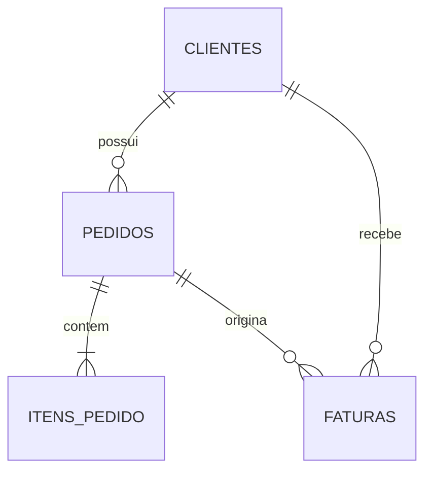

# Data Model: Agente de Vendas B2B

## Banco

- Arquivo: `vendas_b2b.db`.
- Entidades de negocio: exatamente `Clientes`, `Pedidos`, `Itens_Pedido` e `Faturas`.
- Chaves estrangeiras habilitadas na conexão.
- Valores monetários representados por `Decimal` com escala de duas casas e moeda BRL.

## Entidades e relacionamentos

### Clientes

`id_cliente` PK, `razao_social`, `nome_fantasia`, `cnpj` UNIQUE, `limite_credito`, `status`, `created_at`, `updated_at`.

Constraints: CNPJ normalizado e único; limite não negativo; status em `ativo`, `inativo`, `bloqueado`.

### Pedidos

`id_pedido` PK, `id_cliente` FK obrigatória, `data_pedido`, `status`, `valor_total`, `prazo_entrega_previsto`, `data_entrega_real`, `created_at`, `updated_at`.

Constraints: total não negativo; entrega real obrigatória somente para `entregue`; previsão não anterior ao pedido; pedido confirmado exige item.

### Itens_Pedido

`id_item` PK, `id_pedido` FK obrigatória, `codigo_produto`, `descricao_produto`, `quantidade`, `preco_unitario`, `desconto`, `subtotal`.

Constraints: quantidade maior que zero; preço e desconto não negativos; desconto não excede bruto; subtotal calculado; item órfão proibido.

### Faturas

`id_fatura` PK, `numero_fatura` UNIQUE, `id_cliente` FK obrigatória, `id_pedido` FK opcional, `data_emissao`, `data_vencimento`, `valor_total`, `valor_pago`, `status`, `data_pagamento`, `created_at`, `updated_at`.

Constraints: vencimento não anterior à emissão; pago entre zero e total; data de pagamento obrigatória somente em `paga`; pedido associado deve pertencer ao mesmo cliente.

## Regras derivadas

- `subtotal = quantidade * preco_unitario - desconto`.
- `saldo_fatura = valor_total - valor_pago`.
- `exposicao_em_aberto = soma(saldo_fatura)` de faturas não canceladas.
- `saldo_disponivel = max(0, limite_credito - exposicao_em_aberto)`.
- Fatura vencida: não cancelada, não liquidada e `data_vencimento < data_referencia`.
- Pedido atrasado: não cancelado, não entregue e previsão anterior à data de referência.
- Dias de atraso: diferença entre data de referência e vencimento, somente para fatura vencida.

## Transicoes aceitas

- Pedido: `pendente -> confirmado -> em_separacao -> enviado -> entregue`.
- Pedido pode ir para `cancelado` antes de `entregue`; nenhuma transição destrutiva será exposta ao agente.
- Fatura: `aberta -> vencida` quando a data de referência ultrapassa o vencimento; `aberta`/`vencida -> paga`; estados pagos e cancelados são finais para o MVP.
